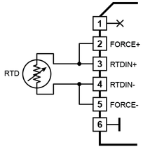
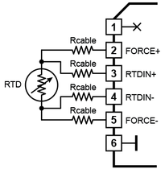

# Test application for the RTD Temperature Meter Tibbit (#22)

This Tibbo BASIC demo application supports PT100, PT200, PT500, and PT1000 sensors (this is selectable in code, see the main.tbs file).

Tibbit #22 is very accurate. Here are the results of measurement comparisons between the Tibbit #22 and a Fluke 726 process calibrator:

- PT100 sensor: Measurements performed by the Tibbit deviated from those of the calibrator by no more than 0.5 degrees C in the temperature range from -100C to +400C. The error did not exceeded 2.5 degrees C outside of this temperature range.
- PT1000 sensor: Measurements performed by the Tibbit deviated from those of the calibrator by no more than 0.5 degrees C in the temperature range from -125C to +550C. The error did not exceeded 2.5 degrees C outside of this temperature range.

You will need:

- TPP2, TPP2(G2), TPP3, or TPP3(G2) board
- One Tibbit #22 (RTD)
- One Tibbit #20 (9 pin Terminal Block)
- Optionally, one Tibbit #9 or #10 (12V->5V regulator)
- Optionally, one Tibbit #18 (power jack)

Connecting the RTD sensor

You can use 2-wire or 4-wire sensor connection. The 2-wire connection does not allow the system to compensate for errors caused by cable resistance. Therefore, this type of connection is suitable for cases where the sensor cable is short.

The 4-wire connection eliminates errors caused by cable resistance. It is recommended for cases where the sensor is located at some distance from the Tibbit.

  

  