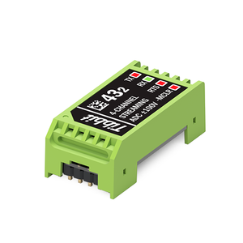

# Tibbit #43-2

## Introduction

This repository contains the firmware for the PIC16F1825 microcontroller integrated into Tibbit #43-2 Four-Channel Streaming ADC ±100V. The microcontroller enables low-jitter sampling of analog data while enhancing the linearity and precision of analog-to-digital conversions. Upgrades to the microcontroller's firmware will be made available here as they are released, and customers are welcome to submit their improvements to the code.

Tibbit #43-2 is based on the AD7323 12-bit+sign successive-approximation analog-to-digital converter IC. It offers four single-ended or two differential channels. In the differential mode, the data streams of two AC signals can be sampled for digital signal processing operations, such as phase detection and power quality factor calculations. However, special care must be taken, as this is not an isolated Tibbit. 

Tibbit #43-2 has an input range of ±100V in the single-ended mode and ±200V in the differential mode. It can be used to interface with industrial pressure, temperature, and other types of transducers. The wide input range also affords the ADC protection from high-voltage transients; for example, voltage spikes when sampling vehicle battery voltages. These capabilities make Tibbit #43-2 ideal for Internet of Things (IoT), Industrial IoT (IIoT), and industrial automation applications that require continuous sampling of instruments and on-the-fly analog-to-digital conversion of the data.

If you need even greater precision but not as wide a voltage input range, consider using [Tibbit #43-1](https://tibbo.com/store/tps/tibbits.html#/?filter=%2343_1) instead.

  

  

## Developer's Guide

The pin assignments of Tibbit #43-2 are illustrated in the following diagram:

  

The files in this repo were designed to work with the MPLAB X integrated development environment and the MPLAB XC8 PRO compiler.

Most operations, including math and signal conditioning, are performed in `operate.c`.
Parsing mechanisms and the command sequence are contained in `command.c`.
All components related to microchip drivers and peripherals are located inside the `mcc_generated_files` folder.

## Firmware Upgrades

The microcontroller's firmware can be upgraded in the system without any external hardware. Firmware updates take place through the microcontroller's low-voltage programming (LVP) mode. The Tibbit's TX line acts as ICSPCLK, the RX line as ICSPDAT, and the –MCLR line puts the microcontroller into the LVP mode.

For more information on LVP, please see [this resource](https://microchipdeveloper.com/8bit:lvp).

**Note:** The Tibbit is calibrated at the factory for precision. Before upgrading the firmware of your Tibbit, make sure to copy the values of the three calibration parameters (SA, SB, and SN); you will need to set them after completing the update. 

## Application Notes

Thanks to the combination of a wide input range and outstanding precision, Tibbit #43-2 can be used in a wide range of applications, from reading ubiquitous industrial transmitters (e.g., temperature and pressure sensors) to battery bank and solar panel monitoring and automotive applications. This Tibbit is intended to be used as a **multichannel** voltmeter and enables remote voltage metering as part of the [Tibbo Project System (TPS)](https://tibbo.com/store/tps.html).

Tibbit #43-2 is an ideal solution for applications outside of the typical 0-10V range or when spikes or high-voltage transients are likely. For example, battery packs usually range from 12V to 60V and sometimes even higher at full charge. No additional signal attenuators are needed with Tibbit #43-2, which can be directly connected to the intended signal — you don't even have to worry about polarity, as it covers both the negative and positive input ranges.

Some applications, such as phase detection and measurement and power factor calculation, require AC signal sampling in conjunction with current transformers (CTs) and voltage transformers (VTs) for level conditioning of the signal. Tibbit #43-2 is robust enough to enable the use of off-the-shelf, low-turn-ratio CTs and VTs at precise sampling rates of up to 1,000 samples per second.

Tibbit #43-2 — developed and manufactured by Tibbo Technology Inc. — is a robust solution for industrial environments. It features a user-friendly and reliable command interface implemented over UART. When combined with the TPS — particularly the [Size 3 Linux Tibbo Project PCB, Gen. 2](https://tibbo.com/store/tps/ltpp3g2.html) — Tibbit #43-2 can be used to realize a wide range of IoT, IIoT, and process control and monitoring solutions for a wide range of Industry 4.0 applications. The combination of this Tibbit and the TPS platform makes sensor-to-cloud, remote I/O, and IIoT deployments robust, user-friendly, and cost-effective.

As a member of the TPS platform, Tibbit #43-2 is fully supported by the [CODY project code generator](https://cody.tibbo.com), as well as Tibbo's dedicated support team. CODY accelerates the development of your IoT solutions by creating a framework for your project that uses Tibbo's best practices and reduces the amount of time you spend coding.

## Useful links
* [Tibbo](https://tibbo.com)
* [Tibbit #43-2 — Official Product Page](https://www.tibbo.com/store/tps/tibbits.html#/?filter=%2343_2)
* [Tibbit #43-2 — Official Documentation](https://docs.tibbo.com/phm/tibbit_43-2)
* [Tibbit #43-2 Interface Protocol Documentation](https://docs.tibbo.com/phm/tibbit_43-2_interface)
* [CODY — Tibbo's Project Code Wizard](https://cody.tibbo.com)
* [Contact Tibbo Support](https://tibbo.com/support/contact.html)